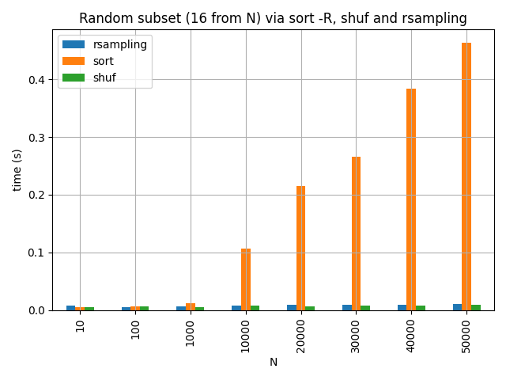
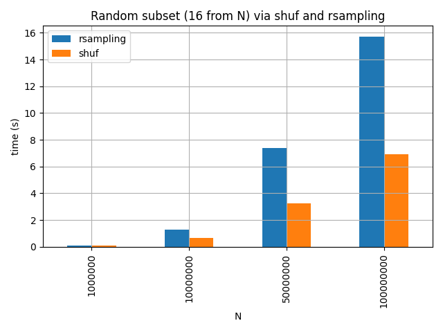
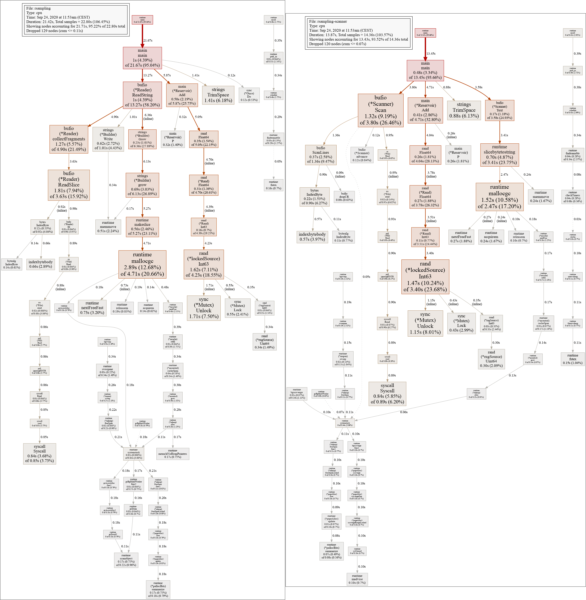
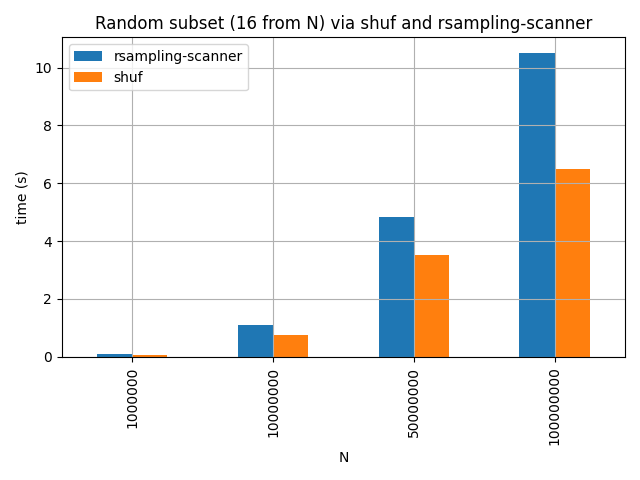

# Productive Go

Three reasons why Go is a productive language. A personal review.

> Martin Czygan, <martin.czygan@gmail.com>, 2020-XX-XX, Developer Group Leipzig (online)

----

# About Me

* software developer at [Leipzig University Library](https://ub.uni-leipzig.de)
  (Library of the Year 2017) and data engineer at the [Internet
  Archive](https://archive.org) - check out [Archive
  Scholar](https://scholar.archive.org), a search engine for scholarly documents
* open source [contributor](https://github.com/miku), [computer
  scientist](https://dblp.org/search?q=martin+czygan),
  [lecturer](https://lancasterleipzig.de) and [author](https://g.co/kgs/Dka5z8)
* co-host of [Leipzig Golang User Group](https://golangleipzig.space/), [meetup.com/Leipzig-Golang](https://www.meetup.com/Leipzig-Golang/)

I started to use Go in 2013, that must have been [Go 1.1
release](https://golang.org/doc/devel/release.html). The first program was a
replacement for a Java command line tool.

----

# Random

In my spare time, I sometimes take part in hackathons ([join
me](mailto:martin.czygan@gmail.com)); last time I
[created](https://github.com/miku/dvmweb) slot machine animations with a
[numpy](https://numpy.org/):

----

# Overview

* all languages have (significant) tradeoffs
* in this talk I want to highlight a few positive aspects of the language; there are
  many more
* Go is not great because of a single killer feature; in fact none of the
  highlights is that extraordinary, but the it adds up
* I believe, Go will become more popular (slowly) because it does less (and less can be more)

----

# Three reasons

* Performance
* Ergonomics
* Deployment

----

# Reason 1: Performance

Go is fast.

----

# Fast compilation

It starts with dependency management.

> In 1984, a compilation of ps.c, the source to the Unix ps command, was
> observed to #include <sys/stat.h> 37 times by the time all the preprocessing
> had been done. Even though the contents are discarded 36 times while doing
> so, most C implementations would open the file, read it, and scan it all 37
> times. -- [https://talks.golang.org/2012/splash.article#TOC_5.](https://talks.golang.org/2012/splash.article#TOC_5.)

So, compile time reduction starts with less I/O.

----

# Go blurs the line

* Go first appeared on November 10, 2009 (remember [Google Tech Talks](https://www.youtube.com/watch?v=rKnDgT73v8s)?)

A few years before, there seemingly was a cold war going, since Erik Meijer et
al. published [Static Typing Where Possible, Dynamic Typing When Needed:The End
of the Cold War Between Programming
Languages](https://www.ics.uci.edu/~lopes/teaching/inf212W12/readings/rdl04meijer.pdf).

The paper goes into a "softer type system" direction, but Go also wanted to end
this war. It wanted to be a safe language (static) that was fun to write (dynamic).

On part of that is: Can I run this instantly? And in Go, you can, with `go run
prog.go` it sure feels fast.

----

# Go is fast enough

* there is a (assumed) optimum for a given problem, between how fast it is, and how quickly you can implement it

A tradeoff between time spent and runtime, e.g. as you **increase** the time spent
on programming, the running time **comes down**.

Let's look at one example.

----

# Fast enough Reservoir Sampling

[Reservoir sampling](http://www.cs.umd.edu/~samir/498/vitter.pdf) is a powerful
technique to get a sample of a fixed size from a potentially infinite stream.

* Not POSIX, but included in GNU core utils is
  [shuf](https://www.gnu.org/software/coreutils/manual/html_node/shuf-invocation.html),
which uses reservior sampling (since 2013) - I use shuf regularly (and also
once needed a variant to shuffle large files, and found
[terashuf](https://github.com/alexandres/terashuf) - porting that C++ program
to Go is still a TODO).

> Hi,
> I would like to know why shuf.c is using reservoir sampling +
> write_permuted_output_reservoir rather than just using an inside-out version
> Fisher-Yates shuffle. -- [https://lists.gnu.org/archive/html/coreutils/2013-12/msg00165.html](https://lists.gnu.org/archive/html/coreutils/2013-12/msg00165.html)

A Go version: [rsampling](https://github.com/miku/rsampling)

The wikipedia page on `shuf`
[mentions](https://en.wikipedia.org/wiki/Shuf#See_also) `sort -R`, so let's
see:

----

# Fast enough is enough

Let's zoom in.

The Go project is 91 lines of code of which 12 are imports - standard library
only - which my [editor](https://github.com/fatih/vim-go) completes for me.
Also 6 lines for a "version" flag. It responds to SIGINT, which is a
nice-to-have and 12 more lines. Essentially around 60 lines of code.

It did not took long to write the Go version, and the initial, unoptimized
version was *fast enough*.

----

# A bit of optimization

Go has been described as both high and low level language. One optimization for
rsampling relates to memory allocation.

The following is an output of the builtin [go
profiler](https://blog.golang.org/pprof), left Reader, right Scanner. It is
hard to see, but the Scanner is lighter on "malloc".

----

# Scanner is a bit faster

Sample size of
[one](https://stats.stackexchange.com/questions/157582/what-can-we-say-about-population-mean-from-a-sample-size-of-1).

----

# Do more with more (cores)

Interestingly, Go has concurrency support built into the language. The keyword
is `go` which starts a goroutine. A goroutine is a lightweight thread, managed
by the Go runtime.

The main idea is concurrency, to allow for more suitable decomposition of a
program into components.

Think of a web server: You may want accept a connection, then delegate the work
onto a separate thread. You could use a thread pool - but what should be its
size? You handle the request asynchronously, but that may needs async ops all
the way down?

CSP offers another option, have sequential parts that communicate with each
other (to synchronize or to exchange values).

----

* go is fast
* fast compilation
* fast enough
* low level, high level
* concurrent programming; raw patterns
* implement JSON parser; SIMD
* show off cubietruck ARM, CRUD App, 500 r/s

----

# Reason 2: Ergonomics

* emphasis on reading code
* gofmt
* can read code of key value stores, or more complex pieces of code
* regular language, tools on code
* high level, low level
* stdlib ftw
* writing complete crud apps with minimal dependencies

----

# Reason 3: Deployment

* single binary
* what is in that binary; show off
* smaller linux images
* cross-compilation
* selective compilation

