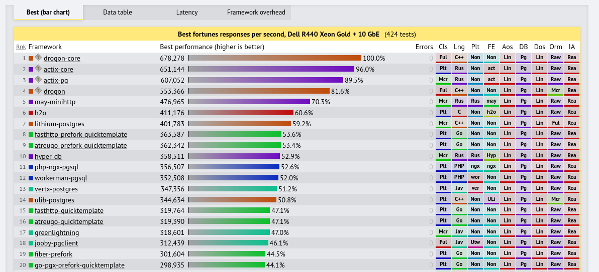
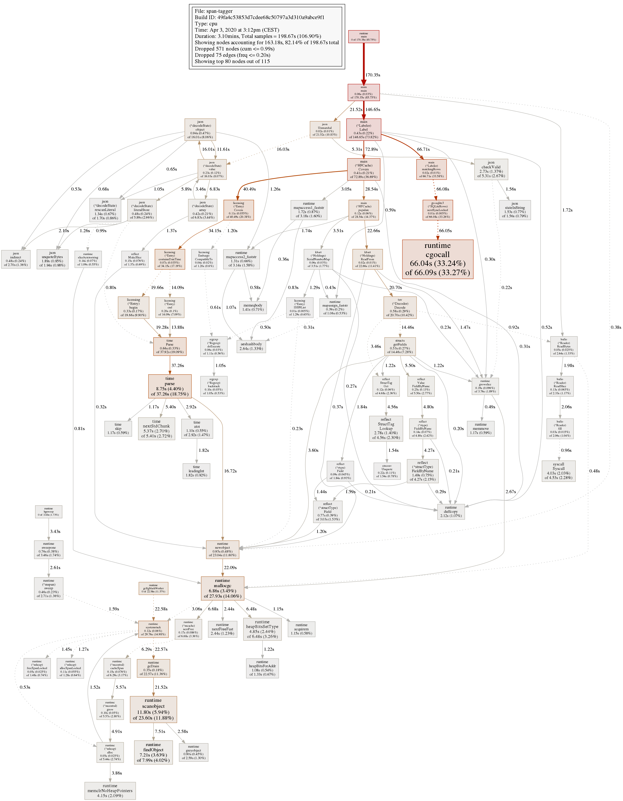

# Productive Go

Three reasons why Go feels like a productive language. A personal review.

> Martin Czygan, <martin.czygan@gmail.com>, 2020-12-08, [Developer Group Leipzig (online)](https://www.meetup.com/Developer-Group-Leipzig/events/273876459/)

----

# About You

* most informative, if you have little (or no) Go exposure
* if you have done a lot of Go, then maybe not too many surprises

----

# About Me

* software developer at [Leipzig University Library](https://ub.uni-leipzig.de)
  (Library of the Year 2017) and data engineer at the [Internet
  Archive](https://archive.org) - check out [Archive
  Scholar](https://scholar-qa.archive.org), a search engine for scholarly documents
* open source [contributor](https://github.com/miku), [computer
  scientist](https://dblp.org/search?q=martin+czygan),
  [lecturer](https://lancasterleipzig.de) and [author](https://g.co/kgs/Dka5z8)
* co-host of [Leipzig Golang User Group](https://golangleipzig.space/), [meetup.com/Leipzig-Golang](https://www.meetup.com/Leipzig-Golang/)


I started to use Go in 2013, that must have been [Go 1.1
release](https://golang.org/doc/devel/release.html). The first program was a
replacement for a Java command line tool.

----

# Random

In my spare time, I sometimes take part in hackathons ([join
me](mailto:martin.czygan@gmail.com)); last time I
[created](https://github.com/miku/dvmweb) slot machine animations with [numpy](https://numpy.org/):


----

# Overview

* all languages have (significant) tradeoffs
* in this talk I would like to highlight a few positive aspects of the language; there are
  many more
* Go is not great because of a single killer feature; in fact none of the
  highlights is *that* extraordinary, but little things add up
* I believe, Go will become more popular (slowly) because it does less (and [less can be more](https://commandcenter.blogspot.com/2012/06/less-is-exponentially-more.html))

----

# Three reasons

* Performance
* Ergonomics
* Deployment

----

# Reason 1: Performance

Go is fast.

----

# Fast compilation

It starts with dependency management.

> In 1984, a compilation of ps.c, the source to the Unix ps command, was
> observed to #include <sys/stat.h> 37 times by the time all the preprocessing
> had been done. Even though the contents are discarded 36 times while doing
> so, most C implementations would open the file, read it, and scan it all 37
> times. -- [https://talks.golang.org/2012/splash.article#TOC_5.](https://talks.golang.org/2012/splash.article#TOC_5.)

So, compile time reduction starts with less I/O.

Example: A 67529 LOC project, seaweedfs: with empty go build cache: 67s, subsequent builds: 8s.

----

# Go blurs the line

* Go first appeared on November 10, 2009 -- remember [Google Tech Talks](https://www.youtube.com/watch?v=rKnDgT73v8s)?

A few years before, there seemingly was a cold war going on, e.g. [Erik Meijer](https://en.wikipedia.org/wiki/Erik_Meijer_(computer_scientist)) et
al. published [Static Typing Where Possible, Dynamic Typing When Needed: The End
of the Cold War Between Programming
Languages](https://www.ics.uci.edu/~lopes/teaching/inf212W12/readings/rdl04meijer.pdf).

The paper goes into a "softer type system" direction, but Go also wanted to end
this war. It wanted to be a *safe* language (static) that was *fun* to write (dynamic).

One part of that is - can I run code instantly? And in Go, you can, with `go
run prog.go` - which will usually be fast.

----

# Go is *fast enough*

* Go is not the fastest language, but fast enough
* there is a (assumed) optimum for a given problem, between how fast a solution is, and how quickly you can implement it

A tradeoff between time spent and running time - e.g. as you **increase** the time spent
on programming, the running time **comes down**.


Let's look at one example.

----

# Fast enough Reservoir Sampling

[Reservoir sampling](http://www.cs.umd.edu/~samir/498/vitter.pdf) is a powerful
technique to get a sample of a fixed size from a potentially infinite stream.

* Not POSIX, but included in GNU core utils is
  [shuf](https://www.gnu.org/software/coreutils/manual/html_node/shuf-invocation.html),
which uses reservior sampling (since 2013) - I use shuf regularly (and also
once needed a variant to shuffle large files, and found
[terashuf](https://github.com/alexandres/terashuf) - porting that C++ program
to Go is still a TODO).

> Hi,
> I would like to know why shuf.c is using reservoir sampling +
> write_permuted_output_reservoir rather than just using an inside-out version
> Fisher-Yates shuffle. -- [https://lists.gnu.org/archive/html/coreutils/2013-12/msg00165.html](https://lists.gnu.org/archive/html/coreutils/2013-12/msg00165.html) | *Reservoir sampling is used to limit memory usage*

A Go version: [rsampling](https://github.com/miku/rsampling)

The wikipedia page on `shuf`
[mentions](https://en.wikipedia.org/wiki/Shuf#See_also) `sort -R`, so let's
see:


----

# Fast enough is enough

Let's zoom in.


The Go project consists of 91 lines of code of which 12 are imports - standard library
only - which my [editor](https://github.com/fatih/vim-go) completes for me.
Also 6 lines for a "version" flag. It responds to [SIGINT](http://people.cs.pitt.edu/~alanjawi/cs449/code/shell/UnixSignals.htm), which is a
nice-to-have and 12 more lines. Essentially around 60 lines of code.

It did not took long to write the Go version, and the initial, unoptimized
version was *fast enough*.

----

# A bit of optimization

Go has been described as both high and low level language. One optimization for
rsampling relates to memory allocation.

The following is an output of the builtin [go
profiler](https://blog.golang.org/pprof), left Reader, right Scanner. It is
hard to see, but the Scanner is lighter on allocations.


----

# Scanner is a bit faster


That is not too bad for a garbage collected, memory-safe language (even if the sample size is
[one](https://stats.stackexchange.com/questions/157582/what-can-we-say-about-population-mean-from-a-sample-size-of-1)).

----

# Web framework performance benchmark

* 6/20 top frameworks written in Go (positions: 8, 9, 15, 16, 19, 20); behind
  C, C++ and Rust, but before any PHP, Java, C#, JS or Python framework.

[](https://www.techempower.com/benchmarks/)

----

# The free lunch is over

* [Free Lunch Is Over](https://www.cs.utexas.edu/~lin/cs380p/Free_Lunch.pdf)

> In this article, I’ll describe the changing face of hardware, why it suddenly
> does matter to software, and how specifically the concurrency
> revolution matters to you and is going to change the way you will likely be
> writing software in the future.

Interestingly, Go has concurrency support built into the language. The keyword
is `go` which starts a goroutine.

----

# Concurrency

* a way to decompose a program first (see also: [Concurrency is not parallelism](https://blog.golang.org/waza-talk))
* a concurrent program *may* run in parallel, when possible
* used in popular parts of the standard library, e.g. in [net/http](https://golang.org/pkg/net/http/)

----

# Raw Primitives

* Go [CSP](https://golang.org/doc/faq#csp) concurrency primitives can feel raw

However, concurrency can be wrapped into a synchronous model. Example (parallel command line [filter](https://en.wikipedia.org/wiki/Filter_(software)), error handling omitted):

```go
parallel.NewProcessor(os.Stdin, os.Stdout, func(p []byte) ([]byte, error) {
    var data Data
    json.Unmarshal(p, &data)
    ...
}).Run()
```

No thread, goroutine, channel or select, yet it will use all cores and will use
batching to keep balance communication overhead.

----

# Reason 2: Ergonomics

> ISO 6385 "Ergonomic principles in the design of work systems"

> It describes an integrated approach to the design of work systems, where
> ergonomists will cooperate with others involved in the design, with attention
> to the **human**, the **social** and the **technical** requirements in a
> balanced manner during the design process.

----

# Theme of reduction

* fewer keywords in the language (Go: 25, C: 32, Python: 33, Java: 52)
* singular implementation of data structures (slice, map, struct)
* no classes
* single option for formatting code
* use standard library only (if applicable)

In general, reduce the number of ways thing can be done - especially use a
restrictive approach to language development - add **new stuff** to the language very conservatively.

Prime example: Discussion about *generic data types* is going on for about a
decade. The language itself is very stable, boring.

> Note: The reduction theme does come with lot of discussion - and at times
> difficult conversations, as Go is maintained mostly by Google.

----

# A single tool

* the `go` tool compiles, run, tests (including race conditions), checks, formats, ... your code
* as opposed to the language, this tool has seen quite some changes, e.g.
  support for Go modules for dependency management

Note: I still use Makefiles in Go projects, because I like to just type "make".

----

# Standard library is biased, but powerful

* the `net` and `net/http` packages make your life easier (up to the point, where you do not need any web framework for simple services)
* templating support

Anecdata: The dependency file for a [proxy
server](https://github.com/miku/httpgetaway/blob/master/ProxyIntro.md) I wrote
this year (and that dependency is something nice-to-have):

```
module github.com/miku/fluxproxy

go 1.13

require github.com/sethgrid/pester v1.1.0
```

Extension points and composability:

* the `io` package, and `io.Reader` and `io.Writer`
* the `net/http` allows to plug in functionality through configuring its layers
  (timeout, proxies, redirect handing, tracing, ...)
* many more [...]

----

# Readability

A very human factor, the desire for understanding - while at the same time
having to deal with cognitive load ([2002](https://files.eric.ed.gov/fulltext/ED477013.pdf), [2020](https://computethought.blog/2020/05/18/cognitive-load-and-coding/), ...).

* the `go fmt` is probably technically trivial, but impactful
* the premise: it is better for collaboration to use a single *style*
* sets the tone: Go is a language that is made to be *rearranged* by tools
* in the best case, code gets *impersonal*

----

# Readability and larger projects

I find it still hard to read through larger projects (and understand all the
bits and pieces), but I know what to expect.

* because Go is a bit more readable (and less noisy), you can read more code
* it is also easier to spot *unusual* code, since it stands out more

----

# Reason 3: Deployment

How many years of effort would be saved, if 1M programmers would care one
hour less on deployment issues per month?


> 115 years/month, or **1380 years/year**

----

# Single binary

Other ecosystems are chasing the "small deployment artifact" target - (I
[ranted](https://github.com/miku/packpy) a bit about it on stage).

* single binary
* the go 1.15.2 amd64 *hello world* binary is 2.5MB (2034794)

> **left** Go, default flags **right** C


It includes the Go runtime. There might be optimization potential:
[36313](https://github.com/golang/go/issues/36313)

If the binary size become a problem, you can apply various techniques:

* `go build -ldflags="-s -w" main.go` (strip debug info and symbol tables) - reduced `hello` to 1.3MB

# Embedding assets

You can go further by embedding assets into your program (e.g. template for a web application, etc).

Note: we had a talk on file embedding in [Leipzig Gophers Meetup #14](https://golangleipzig.space/posts/meetup-14-wrapup/).

# Cross-compilation

Go allows to cross compile code with the default toolchain.

* interesting for ARM servers

It boils down to:

```
$ env GOOS=linux GOARCH=arm64 go build ...
```

# Small OCI images

Compiled Go programs are almost good-to-go Linux images
([example](https://github.com/miku/aboutgo/blob/master/topics/misc/fromscratch/Dockerfile)):

* builder pattern

Assuming container in step 1 contains everything we need to compile the code
(here a program named "fetch"), in step two we are reduced to:

```dockerfile
############################
# STEP 2 build a small image
############################
FROM scratch

# Copy our static executable.
COPY --from=builder /app/fetch /app/fetch

# https://stackoverflow.com/q/52969195/89391
ADD ca-certificates.crt /etc/ssl/certs/

# Run the hello binary.
ENTRYPOINT ["/app/fetch"]
```

We end up with:

```
$ docker images gosp/fetch
REPOSITORY   TAG       IMAGE ID       CREATED          SIZE
gosp/fetch   latest    798273f33023   21 seconds ago   4.94MB
```

# Expvars

> Package expvar provides a standardized interface to public variables, such as
> operation counters in servers.

Programs can register custom *exported variables*, a relatively simple way to expose internal metrics.

## Example: performance and error counter

* from: [https://git.io/JLO5Y](https://github.com/miku/microblob/blob/35dbf3adb0e9ea4ac0e7f3ba2c1f4c7e09844542/handler.go#L14-L18)

```go
var (
    okCounter        *expvar.Int
    errCounter       *expvar.Int
    lastResponseTime *expvar.Float
)

...

func init() {
    okCounter = expvar.NewInt("okCounter")
    errCounter = expvar.NewInt("errCounter")
    lastResponseTime = expvar.NewFloat("lastResponseTime")
}
```

By using a blank import, we include handlers that expose debug information.

```go
import _ "expvar"
```

We get a JSON blob with system and custom information.

```json
$ curl -s 172.18.113.99:8820/debug/vars | jq . | head -20
{
  "cmdline": [
    "/usr/local/bin/microblob",
    "-c",
    "/etc/microblob/microblob.ini"
  ],
  "errCounter": 8,
  "lastResponseTime": 0.00026361,
  "memstats": {
    "Alloc": 23630216,
    "TotalAlloc": 14377908139208,
    "Sys": 76104704,
    "Lookups": 0,
    "Mallocs": 29911720481,
    "Frees": 29911690806,
    "HeapAlloc": 23630216,
    "HeapSys": 65765376,
    "HeapIdle": 39460864,
    "HeapInuse": 26304512,
    "HeapReleased": 32956416,
...
```

The poor man's metrics tracking can be:

```shell
$ while true; do curl -s 172.18.113.99:8820/debug/vars | \
    jq .lastResponseTime; sleep 1; done
0.000478914
0.00035445
0.000101177
0.0001924
0.000177317
0.000185274
```

# The pprof profiler

The pprof package provides facilities for cpu and heap stats, for command line tools or servers.



----

# Wrap Up

* a bunch of niceties, no killer feature
* probably not using Go for data science
* Go is perfect for tools and servers

And of course:

* Gophers are nice, join us at [https://golangleipzig.space/](https://golangleipzig.space/)

----

# [Q19279214](https://www.wikidata.org/wiki/Q19279214)!
